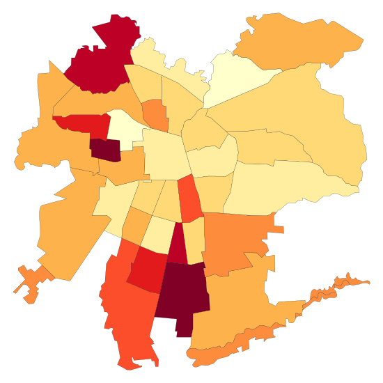

HEATMAP SVG PYTHON TOOL
=======================

Tool for creating a HeatMap from a Pandas DataFrame in Python.

* V 0.1 - Very early stage
* Hardcoded for chilean Data and Region Metropolitana
* Basefiles (Comunas, Dataset and SVG map) need to be on the same folder
* Output is an SVG file

Background
----------

* Dataset was fetched from http://datos.gob.cl/datasets/ver/32415 and it is a study
  of chilean municipalities and how digitally connected and engaged are they.
* Study Dataset: http://datos.gob.cl/recursos/download/4213
* Study Report (157p):
  http://datos.gob.cl/uploads/documentos/informe_municipios_junio_2015_final_.pdf
* The List of Municipalities from Chile was downloaded from
  https://github.com/pinchocorrea/uwork/blob/master/CSVs/comunas.csv
* The Original map was downloaded from Wikimedia:
  https://commons.wikimedia.org/wiki/File:Comunas_de_Santiago.svg

Output
------

* A HeatMap of "Region Metropolitana" of Chile, according to their Local Web Development
  (IDELWEB) Index or the Technological Maturity Index (IMT).
* The IDELWEB measures mainly the Municipal ability to offer Online Services to
  their citizens.
* The IMT masures mainly the Municipal ability to produce online services to
  their citizens. Like Technological Infraestructure, HR, etc.
* The Map shows each Municipality with a different color, according to their relative
  position with other Municipalities from the Map. Darker is worse; Lighter is better

Goal
----

The only goal of this project is to provide a personal tool to easly create
HeatMaps in Python for making nice looking tweets: @slarrain

Credits
-------

This project was heavily based on the work done by FlowingData at:
http://flowingdata.com/2009/11/12/how-to-make-a-us-county-thematic-map-using-free-tools/
